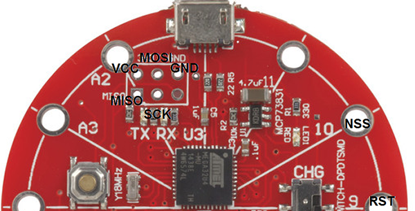
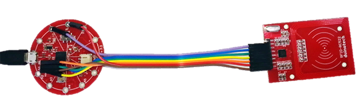
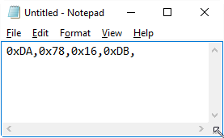

# RFID Password Typer

Tired of typing your password every time you need to log into your computer? Then we have just the thing for you. Carry around an RFID tag (or even use a card you might already have in your wallet), and simply wave it over the reader. Your password is typed for you! Wave the card again, and if you are using Windows, your computer is locked.

Simple project with only three components (some soldering, assembly and programming required).

## Components:


|Qty| Code | Description |
|---|---|---|
|1 | [XC4620](http://jaycar.com.au/p/XC4620) | Lilypad board
|1 | [WC6028](http://jaycar.com.au/p/WC6028) | Plug-socket jumper leads
|1 | [XC4506](http://jaycar.com.au/p/XC4506) | RFID read/write kit *

* (this includes a card and a fob)

## Assembly:

We need to start with assembly, because we don't actually know the identity of the tags yet. We've created a little sketch that types out the code on the tags so you can copy that straight into the sketch to match.

Firstly, take a strip of seven of the jumper leads (going brown-red-orange-yellow-green-blue-purple), and keeping them together, push them onto the RFID module, starting with brown on VCC. The colours aren't important, but will help you follow what we built.


The other end going to the Lilypad has to be soldered, so solder the leads according to the following:

|Lilypad|RFID Module|Colour|Function
|---|---|---|---
|3.3 (on ISP)|VCC|Brown|Power
|9|RST|Red|Reset RFID Module
|GND (on ISP)|GND|Orange|Ground Connection
|MISO (on ISP)|MISO|Yellow|Data from RFID Module
|Between 3.3 and GND|MOSI|Green|Data to RFID Module
|Above TXRX|SCK|Blue|Serial Clock
|10|NSS|Purple|RFID Module Select

The picture here might make it a bit clearer:



Here's how it looks fully assembled:



## Finding out the Tag ID:

The RFID module needs a library to work. Fortunately, there is one that can be installed via the Library Manager (go to Sketch>Include Library>Manage Libraries) and search for 'mfrc522'. There should be just one option- click on it, then click install. If you are using an older version of the IDE or can't get the Library Manager to install the library, there is a zipped version included with this project. You'll see that the below sketches also need the SPI and Keyboard libraries- these should be included in the Arduino IDE. If they are not, you might need to update your Arduino IDE.

Open the RFID_Tag_Typer.ino sketch. Select Lilypad USB as the Board type, select the serial port and upload. If the sketch fails to upload, you can force the Lilypad into upload mode by double clicking the small silver reset button (near A4) on the Lilypad. If the red LED on the Lilypad is fading on and off, you should be able to select the serial port and upload without trouble.

The Lilypad is now programmed to be a keyboard, so be careful what windows you have open, as it might type into any of them. We find it's safest to have a Notepad window open to capture everything.

When you've got Notepad open, wave a tag over the reader, and you should see something like the following appear (if it doesn't, double check your wiring):



This is the identity code of your tag. If you wave the other tag over the reader, you'll see a different code. This is one of the bits of information you'll need to personalise your RFID Password Typer- the other one is your password.

## Sketch:

Now open the RFID_Password_Typer.ino sketch, and looks for these two lines to edit:

```c
byte tag[10]={0x64,0xAE,0xDD,0xFC,};
char pswd[]="********\n";      //password, end with just \n
```

Copy the line from inside Notepad and paste it inside the curly brackets instead of the code that's already there. Then replace the `********` on the next line with your password. It's probably a good idea **not** to save it now, otherwise you'll have your password floating around unencrypted.

You can now upload the sketch to the Lilypad- and if the upload is successful, it will be ready to work straight away. If it didn't upload, you might need to double-click the reset button.

You can now test it by waving your tag over the reader again- the computer should lock. Then wave the tag again, and it should unlock. If it doesn't, **don't keep trying the tag!** You might have the wrong password, then accidentally lock yourself out of your computer, like we did once.

## What next?

If you've already got a wallet full of cards, then you could just use one of those instead. As long as you can get a code out of it with the `RFID_Tag_Typer.ino` sketch, then it can be used for this project instead of one of the included tags. We've tried our bank cards and other smart cards, and they all seem to work.

You might be wondering if it's possible to get the password out of the Lilypad (for example, if someone wanted to steal your password). It is possible, but very difficult without access to pins of the Lilypad, so preventing access to the Lilypad is the best way of securing this system.

You might be wondering if the Leonardo could be used in this project instead of the Lilypad, as they use the same microcontroller IC. The only thing stopping this is that the RFID module runs off 3.3V, the same as the Lilypad. If we connect it to the 5V Leonardo board, it might get damaged, so using the Leonardo is not recommended.
